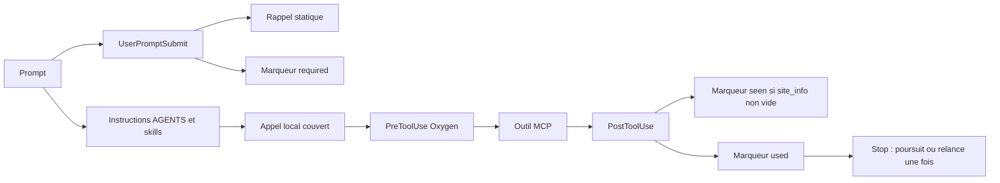

# Candidat A : contrôles Python locaux et preuves propres au workspace

Proposition au commit `203f585`, sans implémentation ni appel WordPress. Propriétaire de ce document : runner A.
Phases : grounding terminé, sketch terminé, comparaison et accord confiés au parent, implémentation hors mission.
Skills appliqués : `skill-gate`, `architect`, `how`, `why`, `arena`, `technical-writing`, `unslop`. Aucun sous-agent lancé, conformément au paquet de mission.

## Problème et contraintes vérifiées

Le kit doit mieux détecter une mauvaise cible et une conclusion fondée sur des preuves périmées, tout en gardant un workflow local léger.
Ses hooks constituent un garde-fou sur les appels couverts. Ils ne peuvent contrôler tous les effets possibles ni rendre un agent incapable de modifier ses fichiers locaux.
Le candidat conserve cette limite. Il n'introduit aucun `permit.json`, jeton signé fictif, contrôle de raisonnement interne ou verdict visuel automatique.

## Usage, vue de l'appelant

Les commandes ci-dessous sont proposées et n'existent pas encore. Elles travaillent à partir d'une mission explicitement autorisée, jamais d'un site déduit.
Le coordinateur prépare une fiche et garde un seul propriétaire par objet. Les lectures indépendantes demeurent possibles sans fiche de site.

```powershell
python scripts/octacom_controls.py mission-check --workspace <WORKSPACE> --mission <FICHE_EXISTANTE>
python scripts/octacom_controls.py evidence-check --workspace <WORKSPACE> --task <TASK_ID>
python scripts/octacom_controls.py runtime-smoke --workspace <WORKSPACE_TEST_ISOLE>
python scripts/probe-codex-runtime.py --cwd <WORKSPACE> --output <PREUVE_RUNTIME>
```

La première commande valide et copie une nouvelle version de la fiche dans `.octacom/missions/<task-id>/<version>.json`.
Elle exige une référence vérifiable à l'autorisation déjà reçue, sans demander une nouvelle confirmation systématique.
Cette référence documentaire reste falsifiable par un agent avec accès au disque. Elle n'est pas une autorisation de sécurité.
La deuxième retourne les preuves manquantes ou périmées par cible. La troisième prépare un test local inoffensif et lit ses effets réels.

Trois sites d'appel, pseudocode dérivé de cette expérience :

```python
# Adaptateur du hook Oxygen, après parsing privé de l'événement.
decision = controls.check_mutation(mission, observed_site, mutation)
# Adaptateur PostToolUse, après contrôle du contrat du connecteur.
controls.record_effect(mission, attempted_mutation, normalized_result)
# Coordinateur, avant un rapport de livraison.
report = controls.check_evidence(mission, current_observations, submitted_evidence)
```

Le hook traduit `Denied` en `permissionDecision: deny`, et `AllowedObserved` en poursuite sur ce seul chemin.
Le rapport expose `ready_for_review`, `stale` ou `blocked`, jamais une certification implicite du site.

## Chemin actuel, de l'entrée à la fin



Le rappel ne lit pas les skills : `inject_skill_gate.main()` ignore l'entrée et injecte une politique statique [source](../../.codex/hooks/inject_skill_gate.py).
`tool_use_gate.needs_tools()` classe le prompt par verbes. `handle()` accepte ensuite tout outil local non exclu, sans vérifier son résultat [source](../../.codex/hooks/tool_use_gate.py).
`oxygen_site_gate.marker()` indexe TEMP par cwd, session et préfixe MCP. `site_info_succeeded()` vérifie seulement un contenu non vide sans erreur booléenne [source](../../.codex/hooks/oxygen_site_gate.py).
La fin ne contrôle ni la pertinence ni les pièces de QA. Les sondes le reproduisent [audit](../research/local-controls-audit-2026-10-01.md).

Le runtime possède le dispatch et la confiance des hooks, le kit possède les scripts et les consignes, le serveur possède l'effet et ses permissions.
L'installateur crée une racine Git exacte, puis partage `.agents` et `.codex` par jonctions vers le kit [source](../../scripts/install-wordpress-development-kit.ps1).
Les attentes métier appartiennent au coordinateur et aux sources autorisées. Elles n'existent pas actuellement dans un état machine du kit.
Le helper visuel possède les supports et empreintes, pas leur provenance ni leur verdict [source](../../.agents/skills/wordpress-oxygen-qa/scripts/compare_visuals.py).

## Rationale issue de l'historique

Preuves directes obtenues par `git show`, `git log` et `git blame` :
- `5c6c1d2` introduit une installation idempotente, sans écrasement, avec validation et rollback ; `a1901ea` réserve le fallback hardlink à une demande explicite.
- `2ca8a79` décrit le rappel comme léger, relancé une seule fois et intentionnellement borné, sans frontière stricte de sécurité.
- `a231b3f` ajoute l'ordre `oxygen_site_info` puis mutations reconnues sur le même connecteur, sans vérification métier automatique.
- `2eab71d` impose les preuves de fidélité et introduit le helper explicitement sans auto-certification.
- Le commentaire attribué par blame à `925a013d` interdit de copier le prompt utilisateur dans les instructions privilégiées de l'injecteur.

Déduction : garder le code partagé et l'état local semble cohérent avec l'installation centralisée et la légèreté annoncée.
Préserver le rappel statique, le propriétaire unique et l'examen visuel. Changer les marqueurs insuffisants et les faux positifs du validateur.
Éviter les journaux de prompts ou arguments bruts et les preuves présentées comme des permissions. Risque conservé : erreurs runtime et voies d'écriture non couvertes.
Sources consultées : Git et documents locaux. Tickets, chat, observabilité, erreurs et analytics non interrogés, car la mission limite la recherche au dépôt.
La documentation externe déjà ouverte décrit le runtime, pas les motivations propres au kit. Aucun historique de PR ou arbitrage humain externe n'est établi.

## Forme et signatures, non implémentées

Types de domaine internes, sans export des objets wire MCP. Les adaptateurs parsèrent les événements et résultats à leur frontière.

```python
@dataclass(frozen=True)
class Mission:
    task_id: str; version: int; workspace_identity: WorkspaceIdentity
    authorization_source: SourceReference
    scope: AuditScope | SiteScope
    required_evidence: tuple[EvidenceRequirement, ...]

@dataclass(frozen=True)
class SiteScope:
    connector: ExactConnectorName; site_url: ConfirmedSiteUrl
    oxygen_version: ConfirmedVersionConstraint
    objects: tuple[OwnedObject, ...]
    consistency: Literal["serial_observed", "atomic_revision"]

@dataclass(frozen=True)
class SiteObservation:
    connector: ExactConnectorName; site_url: ObservedSiteUrl
    oxygen_version: ObservedVersion; mission_version: int; observed_call: CallIdentity

@dataclass(frozen=True)
class Mutation:
    call: CallIdentity; connector: ExactConnectorName
    resources: tuple[ResourceRef, ...]
    owner: OwnerId
    operation: KnownOperation
    revision: NativeExpectedRevision | UnavailableRevision

class Controls:
    def check_mutation(self, mission: Mission, site: SiteObservation | Missing,
                       mutation: Mutation) -> AllowedObserved | Denied:
        raise NotImplementedError("not implemented")
    def record_effect(self, mission: Mission, mutation: Mutation,
                      result: Saved | Failed | Unknown) -> None:
        raise NotImplementedError("not implemented")
    def check_evidence(self, mission: Mission, current: CurrentObservations,
                       evidence: tuple[EvidenceBundle, ...]) -> EvidenceReport:
        raise NotImplementedError("not implemented")
```

Les types dérivent d'entrées validées par code, sans accorder de confiance à `verified: true`. Aucun `agent_id` stable n'est supposé présent dans tous les hooks.
L'attribution d'un propriétaire utilise une identité runtime vérifiée ou une association explicite par session ; si elle manque, la mutation gardée est refusée.
Une session partagée entre sous-agents ne distingue pas leurs propriétaires. Sans identité d'acteur observable, A ne prétend pas faire respecter plusieurs écrivains ; garder les sous-agents en lecture seule pour cette phase.
Un résultat MCP n'est `Saved` qu'après validation de son schéma exact et du critère métier de l'opération. Un texte non vide est insuffisant.

## Modules et stockage

| Module proposé ou adapté | Connaissance possédée |
| --- | --- |
| `scripts/octacom_controls.py` | Domaine, règles de mission, dépendances des preuves, stockage local et trois commandes |
| `.codex/hooks/oxygen_site_gate.py` | Parsing des événements supportés, contrats par opération, traduction des décisions |
| `.codex/hooks/tool_use_gate.py` | Rappel borné, conserve son rôle distinct et aucun verdict métier |
| `.codex/hooks/inject_skill_gate.py` | Politique statique, aucun contenu utilisateur promu en instructions |
| Validateur et installateur existants | Graphes de références, commandes effectives, confinement et existence locale de `.octacom` |
| `scripts/probe-codex-runtime.py` existant | Lecture app-server `config/read`, `hooks/list`, `skills/list`, avec couches effectives |
| `compare_visuals.py` existant | Production ImageMagick, sans seuil ni verdict visuel |

`.octacom` est un dossier réel au workspace, jamais une jonction vers le kit ni un descendant résolu de `.codex`.
Ses fiches versionnées ont un seul écrivain, le coordinateur. Les acteurs déposent leurs preuves dans des sous-dossiers distincts.
L'état machine utilise SQLite local, transactions atomiques par événement et déduplication par identité d'appel runtime. Les preuves restent des fichiers immuables identifiés par empreinte.
Le stockage contient IDs de ressources nécessaires, versions, décisions expurgées et empreintes. Aucun secret, prompt ou argument complet.
Les fichiers locaux demeurent modifiables par le poste. Cette architecture assure une cohérence d'application, pas une défense contre un agent malveillant disposant de ces accès.

## Règles de contrôle et invalidation

Refuser une mutation gardée si fiche absente ou ambiguë, mauvais connecteur, URL différente, version incompatible, objet hors périmètre ou propriétaire inconnu.
Étendre le matcher aux outils des connecteurs WordPress et classifier chaque opération depuis un registre de contrats validés. Un outil non classifié n'est pas réputé lecture seule ; suspendre son usage gardé jusqu'à classification.
Conserver chemin et sous-site dans l'identité URL, normaliser seulement les équivalences établies, ne pas assimiler automatiquement préproduction et domaine final.
Une opération globale exige une portée globale explicite. Une création doit être autorisée avant l'existence de son ID, puis lier l'ID réellement retourné à la mission.
Invalider l'observation avant une nouvelle lecture `site_info`. Réponse erronée, mal typée ou identité absente laisse l'état manquant.
Les champs `site_url` et `builder_version` sont optionnels dans la définition actuellement exposée. Leur absence bloque le contrôle dépendant, sans valeur par défaut.
`oxygen_edit_post` expose `post_id`, `operations` et `success`, sans révision attendue. `get_post_tree` retourne un dictionnaire libre. Aucun CAS serveur n'est démontré.
Si `atomic_revision` est requis, refuser quand la capacité réelle manque. Un hash de relecture locale ne remplace jamais une révision native.
En mode `serial_observed`, le rapport expose l'absence de CAS. La relecture détecte une divergence, mais ne supprime pas la course entre lecture et écriture.
Avant l'appel gardé, marquer ses cibles `pending` et invalider leurs preuves ; après succès, enregistrer l'effet puis exiger une relecture. Après crash ou résultat inconnu, garder `unknown`.
Une mutation partagée invalide les consommateurs du graphe explicite. Graphe incomplet : bloquer la validation finale concernée jusqu'à inventaire.
Une correction Figma invalide ses frames, états et dépendances. Les preuves front fixent URL, cible, viewport, DPR, état, ressources et version sauvegardée réellement observée.
Sans révision native, conserver empreinte, date de lecture et limite de provenance. Ne pas appeler ce substitut une révision serveur.
Le registre vérifie pièces, couverture et fraîcheur. Le coordinateur examine les captures et ferme chaque différence inexpliquée avant le verdict de livraison.

## Vérification et critères de comparaison

Tests purs : URL/version différentes, objets locaux et globaux, création, lecture échouée après réussite, résultat mal formé, changements de mission, dépendances et doublons.
Installer dans deux workspaces TEMP : refuser un `.octacom` lié au kit, vérifier isolation, revalidation idempotente et rollback sans perte des dossiers préexistants.
Smoke runtime dans un projet approuvé : réutiliser la sonde app-server existante pour config, confiance et catalogue, puis tester le dispatch avec un fichier permis et une écriture de fixture refusée avant effet.
Le parent a obtenu hooks activés, huit handlers approuvés et treize skills repo actifs sur le poste. Cette lecture effective ne remplace pas le test d'interception d'un appel réel.
Tester direct, appels imbriqués JavaScript, erreur de script et timeout. Ces deux derniers peuvent laisser passer un hook ; la campagne doit le signaler, jamais annoncer fail-closed global.
Scénarios modèle : connecteurs multiples, changement de cible, information manquante, source injectée, reprise après compaction, fin avec preuve périmée. Évaluer trace et état réel, pas seulement le texte.
Un pilote WordPress demande une cible et une sauvegarde autorisées ; cette mission n'en possède aucune. Les fixtures ne certifient pas le connecteur réel.

## Choix et risques

Interface profonde : trois opérations cachent parsing privé, invalidation, transactions et lecture des pièces ; aucune API par étape load/validate/save.
Compromis accepté : adapter chaque contrat d'outil et maintenir son coverage apporte des refus explicables, avec entretien lors des changements MCP.
Alternative considérée : exécuteur séparé et politique côté serveur, plus forte sur les effets mais impose un nouveau chemin d'appel et une infrastructure.
Alternative rejetée dans A : permis fichier partagé ou hash fourni par le modèle, peu de complexité cachée et aucune authenticité ou atomicité suffisante.
Questions ouvertes : quel runtime fournit l'identité d'appel exploitable ? Quels outils garantissent une révision native ? Quelle politique externe interdit les chemins hors hooks si cette garantie est requise ?
Décision de synthèse : réservée au parent après comparaison avec le candidat B. A n'est ni sélectionné ni mis en œuvre.
Premier pas après sélection : tester parsing et refus d'identité sur fixtures, puis installer le stockage local dans deux workspaces de test avant tout pilote de site.

