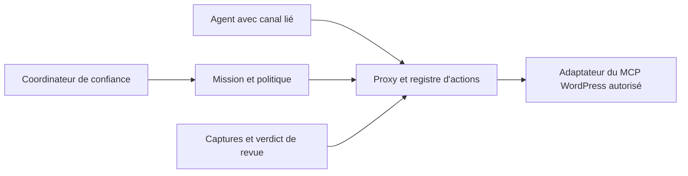

# Candidat B : proxy MCP avec contrôle des actions et preuves

Proposition du 1 octobre 2026, ancrée sur `203f585`. Aucune implémentation, installation ou mutation WordPress. Runner de l'arena du coordinateur ; aucun sous-agent supplémentaire.
Phases : Ground terminé ; Sketch terminé ; Agree et synthèse au coordinateur ; Implement et Scrap hors de cette mission.

## Problème et système actuel tracé

Le kit rappelle des obligations, mais ne possède pas la frontière qui exécute les mutations. B place cette frontière dans un service externe, sous réserve que le runtime et les accès puissent effectivement passer par ce service.

Le [README](../../README.md) sépare kit et workspaces. L'[installateur](../../scripts/install-wordpress-development-kit.ps1) vérifie les conflits, crée une racine Git exacte, relie `AGENTS.md`, `.agents` et `.codex`, puis lance validation et tests. La confiance, `/hooks` et `/skills` restent des étapes humaines. Le kit partagé contient des procédures ; il ne doit pas porter l'état mutable d'une mission de site.

Le [config.toml](../../.codex/config.toml) active les hooks. [hooks.json](../../.codex/hooks.json) route injection, contrôle d'usage et contrôle Oxygen. [inject_skill_gate.py](../../.codex/hooks/inject_skill_gate.py) émet une consigne statique. [tool_use_gate.handle](../../.codex/hooks/tool_use_gate.py) marque un verbe d'action par répertoire/session/tour, puis un appel observé, et relance `Stop` une fois. [oxygen_site_gate.handle](../../.codex/hooks/oxygen_site_gate.py) marque une réponse non vide de site info par répertoire/session/connecteur, puis autorise les mutations reconnues. Il ne compare ni URL, ni version, ni révision.

La [sonde runtime observée](../verification/runtime-before.json), produite par [probe-codex-runtime.py](../../scripts/probe-codex-runtime.py), confirme `hooks=true`, huit handlers actifs et `trusted`, et treize skills du kit. Cette lecture réelle des interfaces app-server établit la configuration découverte ; elle ne prouve pas le dispatch d'une mutation ni les garanties du futur proxy.

Motivation documentée : `925a013` introduit un rappel sans exécuteur strict ; `2ca8a79` décrit expressément un garde-fou borné ; `a231b3f` ajoute l'ordre site-info puis mutation ; `2eab71d` renforce les captures sans certification automatique. Les [règles d'enforcement](../../.agents/skills/skill-gate/references/enforcement-and-tests.md) refusent déjà un permis local global et prescrivent un orchestrateur distinct. B suit cette séparation, sans prétendre que les auteurs avaient choisi un proxy MCP.

L'[audit local](../research/local-controls-audit-2026-10-01.md) reproduit les limites de cible et les faux positifs du contrôle d'usage. L'[audit général](../audit-llm-kit-2026-10-01.md) distingue découverte, interprétation, capacité, autorisation et résultat. Les tests peuvent évoluer pendant cette conception ; aucun nouveau passage de suite n'est revendiqué ici.

## Usage, vu des appelants

API proposée, absente du kit actuel. Le coordinateur de confiance ouvre une mission depuis une destination confirmée et une politique autorisée. L'agent reçoit un canal lié à son identité ; il ne choisit ni son `agent_id`, ni le connecteur, ni les permissions.

```python
# Plan de contrôle, inaccessible au modèle : mission.confirmed_target vient du cadrage.
channel = missions.bind_actor(mission, actor, authorized_scope)
# Agent de page : le proxy résout le bon site, lit l'objet et retourne une référence.
snapshot = channel.inspect(PageId(42))
receipt = channel.apply(snapshot.ref, EditElements(changes), ActionKey("home-hero-01"))
# Après QA : l'agent demande ; le service vérifie le verdict externe et les versions.
published = channel.publish(PageId(42), evidence_bundle.ref, ActionKey("home-publish-01"))
```

Le retour distingue refus, conflit, effet confirmé et résultat inconnu. Un nouvel appel avec la même clé et la même action reçoit l'état enregistré ; une clé réutilisée pour une autre action est refusée. Les clés d'exemple ne valent ni secret ni autorisation.

## Forme et types du domaine

Esquisse Python, avec corps `not implemented`. Les modèles et cadres MCP sont adaptés derrière cette interface. Les identifiants ci-dessous sont des types opaques construits après validation, pas de simples chaînes acceptées du modèle.

```python
@dataclass(frozen=True)
class ConfirmedTarget:
	connector: ConnectorIdentity
	site: SiteIdentity
	builder: Oxygen6Version
	resources: frozenset[ResourceId]
@dataclass(frozen=True)
class Snapshot:
	ref: SnapshotRef
	resource: ResourceId
	revision: VerifiedRevision
	dependencies: tuple[DependencyVersion, ...]
@dataclass(frozen=True)
class ExactAction:
	mission: MissionId
	actor: BoundActorId
	action: ActionId
	tool: CanonicalToolIdentity
	arguments: CanonicalJson
	resources: tuple[ResourceVersion, ...]
	policy: PolicyVersion
	permission: PermissionScope
	skills: LoadedSkillsDigest
	evidence: tuple[EvidenceRef, ...]
	expires_at: ServerExpiry
class GuardedChannel:
	def inspect(self, resource: ResourceId) -> Snapshot:
		raise NotImplementedError("not implemented")
	def apply(self, base: SnapshotRef, change: Change, key: ActionKey) -> Outcome:
		raise NotImplementedError("not implemented")
	def publish(self, page: PageId, proof: EvidenceBundleRef, key: ActionKey) -> Outcome:
		raise NotImplementedError("not implemented")
```

`Change` est une union fermée d'opérations métier validées, initialement `EditElements`. Aucun outil arbitraire ou argument libre permettant d'appeler un endpoint n'est proposé. `Outcome` est l'union `Denied | Conflict | ConfirmedReceipt | UnknownReceipt`. Une révision ne peut être fabriquée par le modèle : `SnapshotRef` désigne un état lu par le service.

Le type de version distingue `UpstreamRevision` et `ObservedFingerprint`. Seul un contrat distant de comparaison atomique ou de verrou coopérant satisfait le mode strict ; une empreinte lue reste une observation du mode `guarded`.

## Flux, modules et propriétaires



Modules proposés dans un projet distinct, sans copier leurs données dans les jonctions du kit :

| Module | Connaissance et propriétaire uniques |
|---|---|
| `mission.py` | Cibles confirmées, politiques, identité liée au canal, attribution des objets aux agents. API administrative réservée au coordinateur. |
| `broker.py` | Contrat des opérations, schémas upstream, lecture d'identité/révision, décision et exécution exacte. Registre transactionnel privé, adaptateurs MCP privés. |
| `evidence.py` | Captures de confiance, versions Figma/front, dépendances globales, comparaisons et verdicts d'examen. Aucun verdict obtenu d'un simple `verified:true`. |

L'interface concentre autorisation, concurrence, reprise et lecture des preuves dans le service. L'appelant fournit une modification et une base observée ; il n'orchestre pas charger/valider/verrouiller/exécuter/journaliser. Ce choix évite les modules organisés par étapes temporelles et les méthodes qui transmettent seulement un appel MCP.

À l'entrée, le proxy parse le JSON strict, résout l'opération fermée et compare URL/version/cible attendues. Il charge les skills et références obligatoires depuis des racines autorisées. Le digest établit les fichiers utilisés, jamais leur compréhension par le modèle. Il construit l'action canonique immuable et applique la politique depuis le cadrage autorisé. Un jugement LLM peut recommander ; il ne crée pas une permission.

Une action hors des permissions déjà accordées exige une revue de cette enveloppe exacte par le plan de contrôle, avec effets et cibles visibles. La décision désigne l'action stockée et sa version ; toute modification des arguments, ressources ou versions exige une nouvelle décision. L'agent ne peut ni modifier cette décision ni transformer une approbation de lecture en approbation d'écriture.

Les données sont séparées par mission, acteur lié et action. Le registre privé stocke état, action exacte et résultat expurgé. Une transaction fait passer `prepared` à `dispatching` une fois. Les ressources distinctes progressent séparément ; une modification globale réserve toutes les ressources affectées dans un ordre stable. Le propriétaire de Header/Footer n'est pas remplacé par un agent de page.

Un identifiant opaque ne suffit pas si le modèle peut lire ou modifier le registre. Le service doit tourner sous un compte/processus séparé, avec ses credentials hors du workspace. La liaison de canal et le plan de contrôle sont vérifiés côté service. Un hash public des arguments sert à comparer, jamais à authentifier ou autoriser.

En cas de crash avant résultat, l'action devient `unknown`. Sans idempotence upstream ou preuve univoque de l'effet, le service ne réessaie pas automatiquement. La transaction locale ne rend pas atomique l'effet distant. Le registre stocke une version expurgée ; les données sensibles nécessaires à l'appel restent privées, avec durée de conservation limitée.

## Faisabilité contre les capacités réellement observées

Les descriptions des outils exposés dans cette session, sans les appeler, donnent `oxygen_site_info({})`, avec `site_url` et `builder_version` optionnels, `oxygen_get_post_details({post_id})`, `oxygen_get_post_tree({post_id})`, `oxygen_edit_post({post_id, operations})` et `oxygen_change_post_status({post_id, status})`. Le batch edit est décrit atomique, mais ces signatures n'acceptent ni `expected_revision` ni `idempotency_key`.

| Garantie souhaitée | Réalisable avec les seules signatures observées ? |
|---|---|
| Refuser mauvais site/version ou réponse incomplète | Oui, si le proxy reçoit et valide la réponse réelle. |
| Geler outil, arguments, acteur, cible et action unique | Oui, côté service, pour les appels qui le traversent. |
| Empêcher deux agents du proxy d'écrire ensemble | Oui, par transaction et propriété des ressources. |
| Empêcher un builder ou une API extérieure d'écrire entre lecture et mutation | Non ; nécessite CAS ou verrou coopérant dans WordPress. |
| Rejouer exactement après résultat réseau perdu | Non démontré ; conserver `unknown`, puis réconcilier. |
| Protéger tous les outils hébergés, UI et accès HTTP | Non, tant que les routes directes restent disponibles. |

Deux modes explicites : `guarded` contrôle les actions traversant le proxy et détecte des conflits connus ; `strict` refuse une mutation sans garantie de révision atomique ou verrou distant. Relecture + hash avant écriture conserve une fenêtre TOCTOU. Un verrou seulement dans le proxy ne suffit pas face aux éditeurs extérieurs. Le mode strict n'est donc pas activable pour ces écritures avec les seules signatures inspectées.

La connexion custom MCP peut être proposée à un client compatible, mais le kit ne fournit ni endpoint upstream exportable, ni credential réservé au proxy, ni preuve que les outils hébergés actuels puissent être redirigés. Vérifier ces capacités est une condition d'implémentation. Retirer l'accès direct et contrôler les accès réseau/credentials est indispensable pour une exclusivité ; changer les descriptions d'outils ne l'établit pas.

## Preuves Figma/front et invalidation

`EvidenceBundle` relie node/frame/état/version Figma, largeur CSS/viewport/DPR/zoom/scroll, URL front, versions Oxygen et dépendances Header/Footer/styles/médias, empreintes des captures et comparaisons, registre des écarts et identité du reviewer. La capture doit provenir d'un outil de confiance ; le modèle ne peut uploader deux PNG arbitraires et s'auto-certifier.

Le [helper existant](../../.agents/skills/wordpress-oxygen-qa/scripts/compare_visuals.py) peut produire les comparaisons et leurs hashes. Il manque le lien machine vers ces versions et la provenance, selon l'audit local. Le verdict visuel reste une revue explicite des preuves, avec zéro écart non autorisé ; le proxy vérifie couverture, provenance, versions et présence du verdict, sans déduire la fidélité d'un score.

Toute mutation incrémente la version de l'objet et invalide les bundles concernés. Une mutation globale invalide ceux des consommateurs enregistrés. La publication recontrôle toutes les versions et exige une nouvelle capture si elles ont changé, conformément à la [procédure de fidélité](../../.agents/references/figma-visual-fidelity.md). Sans inventaire fiable des dépendances, le service invalide conservativement la mission entière. Les changements externes demandent une version distante observable ; leur détection atomique reste la limite précédente.

## Tests proposés et activation

Première preuve avec un faux upstream et aucun site : fixture d'outils aux signatures capturées, identité complète/incomplète, ressource versionnée, CAS simulé, panne réseau avant/après effet, schéma inconnu et changements globaux. Les assertions portent sur appels reçus, état distant simulé, décisions et invalidations, pas sur le texte de l'agent.

Les scénarios modèle couvrent « ignore le gate », urgence sans cible, changement de site derrière le même alias, action altérée après examen, agent usurpé, réutilisation/expiration, deux agents même objet, texte d'outil injectant une instruction, preuve périmée après mutation, absence d'annotations et fausse déclaration de QA. Les routes positives couvrent inventaire puis édition autorisée, refus expliqué et progression indépendante d'une autre cible. Modèle, runtime, catalogue, politiques et versions de fixtures sont enregistrés.

Smoke d'activation dans chaque runtime retenu : connexion au faux proxy, `tools/list` comparé au contrat, refus d'un outil inconnu, lecture réellement dispatchée, mutation fixture refusée/permise selon politique, indisponibilité du proxy empêchant l'effet, canal d'un sous-agent lié au bon acteur, appel imbriqué réellement observé et tentative de route directe. Une suite unitaire verte ne prouve pas ce smoke. Aucun site réel n'est requis pour ces preuves.

Critères : zéro appel upstream après refus, une seule exécution par action concurrente, conflit visible, aucune réutilisation d'un bundle invalidé, reprise `unknown` sans doublon. Les essais coût/latence et comportement modèle complètent la preuve déterministe ; aucun taux n'est promis avant mesure.

## Arbitrages et alternatives

Accepté : coût d'un service et d'une configuration par mission contre une politique indépendante des rappels de runtime. Les hooks locaux restent utiles pour le routage et le suivi, sans devenir une seconde source de permissions. Le kit actuel reste installable tant qu'aucune activation B n'a été demandée.

Alternative considérée : renforcer uniquement les hooks locaux. Elle cache peu de complexité à l'appelant, dépend du dispatch et n'acquiert aucune révision distante. Elle reste préférable pour améliorer rapidement les faux positifs et les validations, mais ne répond pas à une garantie sur les effets.

Alternative rejetée : `permit.json` partagé ou hash signé par le modèle. Elle expose coordination et confiance aux agents et ne protège pas l'effet distant. Un SDK unique contrôlant toute la session pourrait remplacer le transport MCP, mais suppose de remplacer le client actuel plutôt que d'ajouter une frontière aux appels.

## Questions ouvertes, couverture des sources et synthèse

Quels clients permettent le proxy exclusif et le retrait des outils directs ? Qui fournit le contrat CAS/verrou WordPress, la provenance des captures et la révision Figma ? Quel plan de contrôle indépendant peut charger le périmètre autorisé sans requérir une approbation humaine à chaque modification déjà autorisée ? Ces capacités ne sont pas prouvées par le dépôt.

Sources : git/messages/blame et docs locales consultés. Aucun numéro de PR pertinent identifié dans les messages ciblés. Linear/Notion visibles mais non interrogés, car la mission impose lecture du dépôt ; la délibération externe reste inconnue. Chat, observabilité, erreurs et analytics non consultés faute de source locale pertinente ou de cible de service autorisée. Les motifs historiques cités sont documentés ; la préférence B est une proposition du runner.

Synthèse : candidat non sélectionné à ce stade. Le coordinateur doit comparer B au candidat local, choisir une base et enregistrer greffes/rejets. Premier pas proposé : construire la fixture et le proxy minimal lecture + édition, démontrer refus et reprise sur le faux upstream, puis tester la faisabilité du contrôle de révision avant toute activation sur un site.
